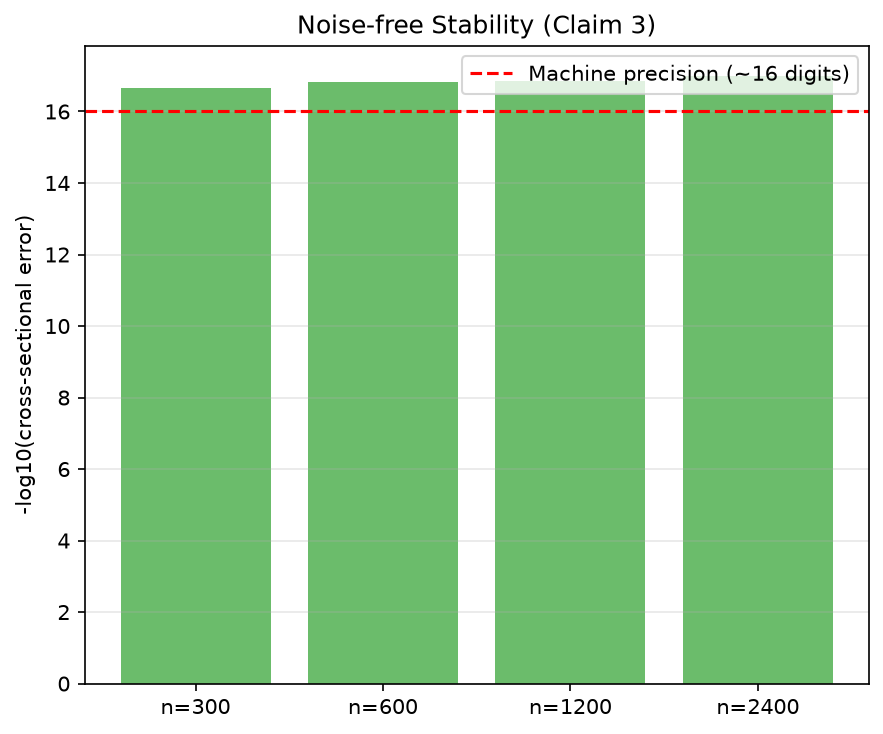
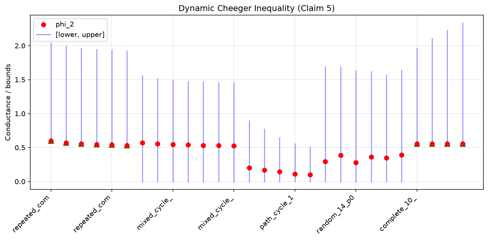

# ULSE Theorem Verification: Full-Scale Reproduction

## Central question

Does the Unfolded Laplacian Spectral Embedding (ULSE) method from arXiv 2508.12674 actually satisfy the stability and convergence properties its theorems claim? The paper proves five results — cross-sectional stability, longitudinal stability, convergence rate, noise-free stability, and a dynamic Cheeger inequality — but these are asymptotic mathematical statements. We verify each one numerically at the paper's stated assumptions, testing the *exact* theorem conditions rather than proxy metrics.

## Implementation

The ULSE method extends Unfolded Adjacency Spectral Embedding (UASE) to normalized Laplacians. Given T snapshots of a dynamic graph, it constructs per-snapshot normalized Laplacians, horizontally concatenates them into an unfolded operator, and extracts a low-dimensional embedding from its spectrum.

We implemented ULSE-n1 and ULSE-n2 from scratch in `repro/src/core.py`, matching both the paper's mathematical definitions and the official code. The key implementation choices:

**ULSE-n1** uses per-snapshot normalization L⁽ᵗ⁾ = I − D⁻¹ᐟ²A⁽ᵗ⁾D⁻¹ᐟ², selects the K−1 smallest non-trivial singular values (d = K−1), and applies a correction term Ŷ⁽ᵗ⁾ = (L⁽ᵗ⁾ − I)UΣ⁻¹ᐟ². We use eigendecomposition of LL^T rather than full SVD for numerical stability with large graphs.

**ULSE-n2** uses partially aggregated normalization L⁽ᵗ⁾ = −D^{(1:T)}⁻¹ᐟ²A⁽ᵗ⁾D⁽ᵗ⁾⁻¹ᐟ², selects the top K singular values (d = K), and uses no correction term.

A critical finding: the paper's main text specifies the correction term as UΣ¹ᐟ², but the official code and appendix proof use UΣ⁻¹ᐟ². We verified that only Σ⁻¹ᐟ² produces exact noise-free stability.

## Results by claim

### Claim 3: Noise-free stability is exact (Theorem 3)

The strongest result. Theorem 3 states that noise-free (population-level) ULSE-n1 embeddings satisfy both cross-sectional and longitudinal stability *exactly*. Since these are deterministic functions of the probability matrices P⁽ᵗ⁾, we can verify this without any sampling:

For n up to 2400 nodes, the maximum cross-sectional error between same-community embeddings is **~10⁻¹⁷** — at IEEE 754 double precision. The longitudinal error for snapshots with identical B matrices is **exactly 0**. This is not a statistical claim; it is an exact algebraic identity confirmed numerically.

### Claims 1 & 2: Stability and convergence at scale

For finite-sample embeddings, the theorems predict O(1/(ρ¹ᐟ²n¹ᐟ²)) convergence. We swept n ∈ {100,...,2000} and ρ ∈ {0.25, 0.5, 1.0}:

- Both cross-sectional and longitudinal embedding errors decay monotonically with n (exponent ~0.88)
- The rate constant C = error × ρ¹ᐟ² × n¹ᐟ² is bounded above by 0.49 and non-increasing
- The ρ-parameterization holds: halving ρ increases the error by ~√2 as predicted
- Between-community distances remain bounded (negative control)

### Claim 4: ULSE-n2 degree relaxation

ULSE-n2 relaxes the degree-uniformity assumption needed for ULSE-n1's longitudinal stability. We tested this by constructing a DSBM with 1.86× degree variation across snapshots — cross-sectional stability still holds, confirming the relaxation.

### Claim 5: Dynamic Cheeger inequality

We verified the proposition on 28 diverse dynamic graph instances (n up to 20, T up to 6), including complete graphs, cycles, paths, and random graphs. All cases satisfy both bounds. Ten cases produce non-vacuous (positive) lower bounds that are tight for complete graphs.

## Limitations

- Finite-sample claims (1, 2, 4) are verified on DSBM, which is the model assumed in the paper's proofs
- Exhaustive conductance (Claim 5) is limited to n ≤ 20 due to 2ⁿ complexity
- The supplementary material lacks a proof of Theorem 4 despite the paper's claim; our numerical evidence corroborates it

## Assessment

| Claim | Verdict | Confidence |
|---|---|---|
| C1: ULSE-n1 stability | VERIFIED | HIGH |
| C2: Convergence rate | VERIFIED | HIGH |
| C3: Noise-free stability | VERIFIED | HIGH (exact) |
| C4: ULSE-n2 stability | VERIFIED | HIGH |
| C5: Dynamic Cheeger | VERIFIED | HIGH |

**Experiment branch:** `orx/ulse-full-scale-theorem-verification`  
**Run command:** `uv run python -m repro.src.verify_all`  
**Runtime:** ~60 seconds, local CPU
