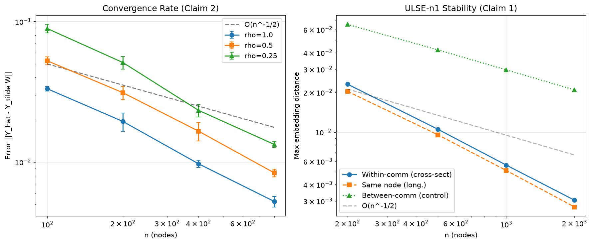

# ULSE finite-evidence audit



## Central question

Do bounded clean-room experiments behave consistently with the stability and
dynamic-Cheeger statements in arXiv 2508.12674? The run provides finite
numerical evidence for five selected constructions. It does not verify the
paper's proofs, almost-sure asymptotics, or complete empirical program.

## Implementation

ULSE-n1 and ULSE-n2 are implemented from scratch in `repro/src/core.py`.
Given dynamic graph snapshots, the code constructs normalized Laplacians,
forms the unfolded operator, and extracts the requested spectral embedding.
The finite run uses DSBM probability matrices and sampled adjacency matrices,
plus small graph families for the dynamic-Cheeger calculation.

The paper's main text and its code/appendix use different exponents for one
correction term. This audit follows the code/appendix convention and records
that choice explicitly; agreement under that convention is not theorem proof.

## Results by claim

| Claim | Finite result | Scope |
|---|---|---|
| C1: Theorem 1 | `FINITE_PROXY_PASS` | Five-seed DSBM sweep, `n` up to 2000; cross-sectional and selected longitudinal errors decay |
| C2: Theorem 2 | `FINITE_PROXY_PASS` | `n` × `rho` sweep, five seeds; finite scaled-error constant ≤ 0.49 and slope 1.655 |
| C3: Theorem 3 | `FINITE_PROXY_PASS` | Deterministic population matrices, `n` up to 2400; selected identities agree near 1e-17 |
| C4: Theorem 4 | `FINITE_PROXY_PASS` | ULSE-n2 DSBM sweep and one degree-varying construction with about 1.86x degree ratio |
| C5: Proposition 1 | `FINITE_PROXY_PASS` | 28 finite graphs, `n` up to 20 and `T` up to 6; 10 lower bounds non-vacuous |

The canonical paper-level result is **0/5 claims independently verified** and
overall **INCONCLUSIVE**. A finite pass means only that the local criterion
passed for the selected construction.

## Limitations

- C1, C2, and C4 use finite DSBM instances and selected parameter sweeps.
- C3 checks finite population identities in floating-point arithmetic.
- C5 uses exhaustive conductance only where `2^n` enumeration is tractable.
- The proof arguments, almost-sure limits, general constants, and broader
  inhomogeneous random-graph cases are not reproduced.
- Real-world dynamic-network data, baselines, figures, and ablations are not
  reproduced.

## Reproduce the audit

```bash
uv run python -m repro.src.verify_all
uv run python -m repro.src.finalize_gate
```

Raw measurements are written to `repro/outputs/verify_all_results.json`.
The conservative machine-readable ledger is written to
`repro/outputs/verdict.json`; it deliberately separates finite proxy passes
from paper-level verification.
